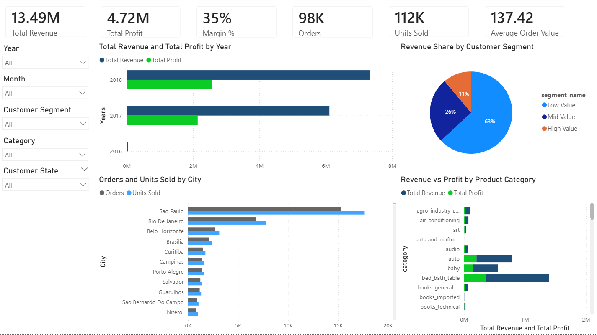
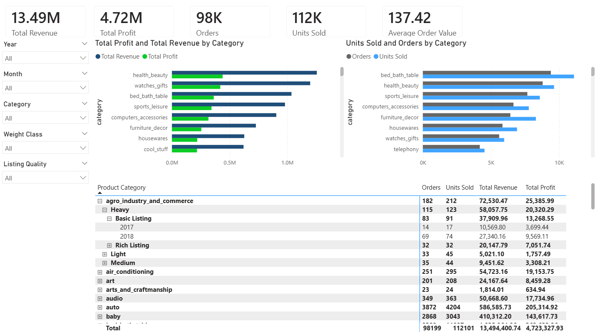
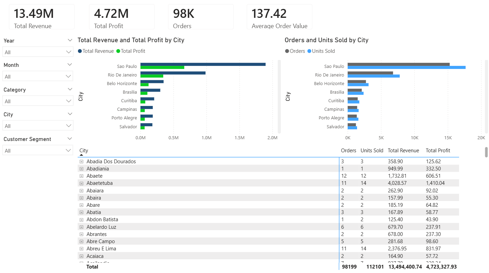
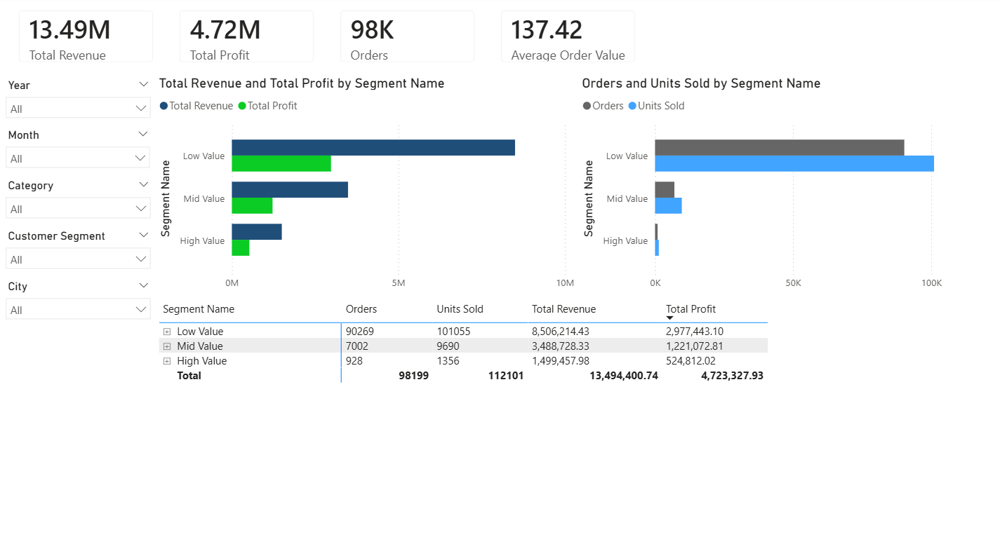

Sales & Commercial Performance Analytics Platform

An end-to-end analytics project demonstrating how raw e-commerce data can be ingested, transformed, modelled into a star schema, and delivered through a multi-page Power BI dashboard for commercial decision-making.

This project simulates a realistic BI workflow used by organisations to monitor sales performance, product trends, geographic distribution, and customer value segmentation.

The repository showcases data engineering, analytics engineering, and business intelligence skills relevant to modern Data Analyst, BI Analyst, and Commercial Analytics roles.

Dataset

This project uses the Olist Brazilian E-Commerce Dataset.

Source:

https://www.kaggle.com/datasets/olistbr/brazilian-ecommerce

The dataset contains transactional data from a Brazilian online marketplace including:

orders

order items

payments

customers

products

product category translations

The dataset spans 2016–2018 and includes roughly 100k orders across multiple product categories and regions.

Project Objectives

The goal of this project is to simulate a realistic commercial analytics solution that answers key business questions such as:

What is total revenue, profit, and margin?

How are sales trending over time?

Which products and categories perform best?

Which regions generate the most revenue?

Which customer segments are most valuable?

What is the average order value?

The output is a business-ready dashboard used to support commercial performance analysis.

Architecture Overview

The project follows a simplified modern analytics pipeline.

Kaggle CSV Dataset
        ↓
Python Data Ingestion
        ↓
PostgreSQL Data Warehouse (Docker)
        ↓
SQL Transformations
        ↓
Star Schema Data Model
        ↓
Power BI Semantic Model
        ↓
Commercial Performance Dashboard

Technology Stack
Tool	Purpose
Python	Data ingestion and preprocessing
PostgreSQL	Data warehouse
Docker	Local database environment
SQL	Data transformation and modelling
Power BI	Semantic modelling and dashboard development
GitHub	Version control and project portfolio
Data Warehouse Design

The warehouse follows a three-layer architecture.

raw
staging
mart
Raw Layer

Stores direct ingestions of the original CSV files from Kaggle.

Staging Layer

Applies transformations such as:

cleaning

joining order tables

normalising product categories

calculating revenue and costs

Mart Layer

Contains analytics-ready tables designed using dimensional modelling.

Star Schema

The reporting model uses a star schema optimised for analytical queries.

Fact Table

fact_sales

Grain: order item level

Measures include:

revenue

profit

margin

freight value

quantity

Dimension Tables

dim_date

dim_product

dim_customer

dim_region

dim_segment

These dimensions allow flexible analysis across:

time

product categories

geography

customer value segments

Dashboard Overview

The Power BI report contains four analytical pages.

Executive Summary

High-level business overview including:

Total Revenue

Total Profit

Margin %

Orders

Units Sold

Average Order Value

Visuals include:

revenue vs profit trend

revenue share by customer segment

orders and units sold by city

revenue vs profit by product category

Product Performance

Product-focused analysis including:

revenue vs profit by category

orders and units sold by category

product attributes such as weight class and listing quality

category level performance tables

Regional Sales Analysis

Geographic performance analysis including:

revenue by city

order distribution by location

city level revenue and profitability

Customer Segmentation

Customer value comparison across:

Low Value

Mid Value

High Value

This page compares:

revenue

profit

orders

units sold

across segments.

Key Metrics

The dashboard calculates the following KPIs:

Total Revenue

Total Profit

Margin %

Orders

Units Sold

Average Order Value

These provide a concise overview of commercial performance.

## Repository Structure
sales-commercial-performance-dashboard
│
├── data
│ └── raw
│
├── docs
│ ├── architecture.md
│ ├── business_rules.md
│ ├── data_dictionary.md
│ ├── kpi_definitions.md
│ ├── PROJECT_OVERVIEW.md
│ └── screenshots
│ ├── executive_summary.png
│ ├── product_performance.png
│ ├── regional_sales.png
│ └── customer_segmentation.png
│
├── powerbi
│ └── sales_commercial_dashboard.pbix
│
├── python
│ ├── ingest_olist.py
│ └── generate_date_dim.py
│
├── sql
│ ├── 01_create_schemas.sql
│ ├── 02_create_raw_tables.sql
│ ├── 03_staging_tables.sql
│ ├── 04_dimension_tables.sql
│ ├── 05_fact_sales.sql
│ ├── 06_views.sql
│ └── 07_data_quality_checks.sql
│
├── docker-compose.yml
├── rebuild_olist_warehouse.ps1
├── requirements.txt
└── README.md

## Running the Project
1. Start PostgreSQL using Docker
docker compose up -d
2. Install Python dependencies
pip install -r requirements.txt
3. Build the warehouse

Run the rebuild script:

.\rebuild_olist_warehouse.ps1

If PowerShell blocks script execution

Some Windows environments prevent local scripts from running.

Temporarily allow the script with:

Set-ExecutionPolicy -Scope Process -ExecutionPolicy Bypass

Then run:

.\rebuild_olist_warehouse.ps1

Note: This setting only applies to the current PowerShell session and does not permanently change your system's execution policy.

This script:

resets the Docker database

creates schemas

creates raw tables

loads CSV data

builds staging tables

generates the date dimension

creates dimension tables

builds the fact table

runs data quality checks

4. Connect Power BI

Connection settings:

Server

localhost:5432

Database

olist

Load the following tables from the mart schema:

fact_sales
dim_date
dim_product
dim_customer
dim_region
dim_segment

Use Import mode and create relationships forming the star schema.

Data Quality Considerations

Several validation checks were implemented including:

duplicate order line detection

null foreign key validation

product category translation checks

margin anomaly checks

A data quality issue was identified in the source product mapping data: 623 products did not have a matching category translation. These records were retained and labelled as Unknown in the reporting model to preserve transaction completeness and avoid excluding valid sales activity from analysis.

This approach keeps the warehouse analytically complete while making the source limitation visible and documented.

Skills Demonstrated

This project demonstrates capabilities in:

SQL transformation logic

dimensional modelling (star schema)

data warehouse design

Python data ingestion

Docker-based database environments

Power BI semantic modelling

commercial KPI design

stakeholder-focused dashboard development

Why This Project Matters

This project demonstrates an end-to-end analytics workflow, not just dashboard creation.

It highlights the ability to:

work with raw datasets

design and build a warehouse model

implement SQL transformations

create a BI semantic model

deliver decision-ready dashboards

This mirrors workflows used by modern analytics teams.

Screenshots

Example dashboard views:

### Executive Summary

### Product Performance

### Regional Sales Analysis

### Customer Segmentation

Power BI Report

The Power BI file is included in this repository:

powerbi/sales_commercial_dashboard.pbix

GitHub may not preview .pbix files directly in the browser because they are binary files, but the report can be downloaded from the repository and opened in Power BI Desktop.

License

This project is open-source and available under the MIT License.

The MIT License allows others to use, modify, distribute, and build upon this work with proper attribution.

See the LICENSE file in this repository for full license details.

Acknowledgements

This project uses the Olist Brazilian E-Commerce Dataset provided on Kaggle.

Dataset source:
https://www.kaggle.com/datasets/olistbr/brazilian-ecommerce

The dataset was originally released by Olist, a Brazilian e-commerce platform that connects small businesses to major online marketplaces.

Special thanks to the dataset creators for making this data publicly available for educational and analytical purposes.

Author

Laurence Clark

Data Analytics | Business Intelligence | SQL | Power BI | Python | PostgreSQL | Docker